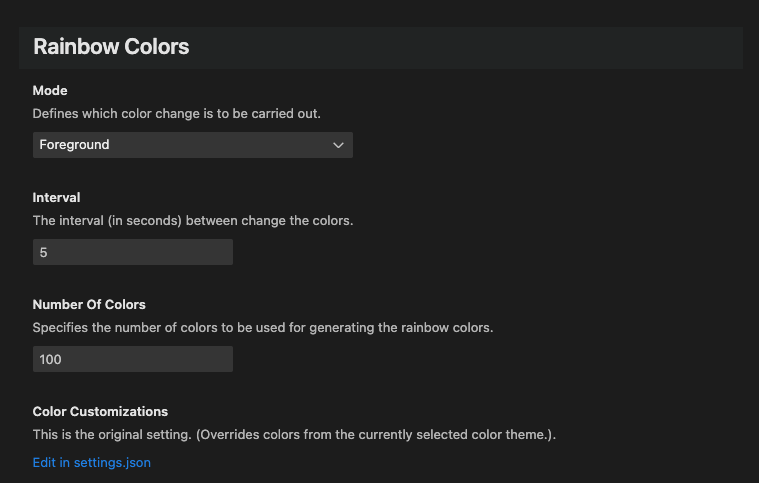

# RainbowColors

**RainbowColors** is an extension that changes the foreground or background color rainbowly after a certain interval.

## Why???

I created this extension because I wanted to learn or expand my knowledge of the following points:

- Have fun developing vscode extensions with vscode.
- TypeScript
- Compiling with tsc
- esbuild (bundling extensions used in VS Code for Web environments)
- VSCode Testing

| Repository                                                                                                                              | GitHub                                                                                                                                                                                                                                                | Visual Studio Marketplace                                                                                                                                                                                                                                        |
| --------------------------------------------------------------------------------------------------------------------------------------- | ----------------------------------------------------------------------------------------------------------------------------------------------------------------------------------------------------------------------------------------------------- | ---------------------------------------------------------------------------------------------------------------------------------------------------------------------------------------------------------------------------------------------------------------- |
|                        |                              |   |
|                                           |   |                                                                                                                    |
|  |                                                                                                                                               |          |
|                    |                                                                                                                                    |                                       |

| Status                                                                                                                                                                                                                                                                                                                                                                                                                                                                                                                                          |
| ----------------------------------------------------------------------------------------------------------------------------------------------------------------------------------------------------------------------------------------------------------------------------------------------------------------------------------------------------------------------------------------------------------------------------------------------------------------------------------------------------------------------------------------------- |
|    |

## Feature

Starts the RainbowColors:

**Shortcut:** `strg + alt + r, s` 
**Command:** `RainbowColors: Start.`

Stops the RainbowColors:

**Shortcut:** `strg + alt + r, e` 
**Command:** `RainbowColors: Stop.`

### Settings

`Preferences -> Settings -> Extensions -> RainbowColors`

| Name                                | Description                                                                                                    | Default Value |
| ----------------------------------- | -------------------------------------------------------------------------------------------------------------- | ------------- |
| `rainbowColors.mode`                | Defines which color change is to be carried. out.                                                              | Foreground    |
| `rainbowColors.interval`            | The interval (in seconds) between change the colors.                                                           | 5             |
| `rainbowColors.numberOfColors`      | Specifies the number of colors to be used for generating the rainbow colors.                                   | 100           |
| `rainbowColors.background`          | Defines which background areas should be changed.                                                              |               |
| `rainbowColors.foreground`          | Defines which foreground (borders and shadows) areas are to be changed.                                        |               |
| `rainbowColors.colorCustomizations` | This is the original colorCustomizations setting. (Overrides colors from the currently selected color theme.). |               |

---

## Installation

To install this extension, you have **three** options:

### 1. Search Extension in Marketplace

Search and install online extension via VSC extensions menu.

`Code` -> `Preferences` -> `Extensions` simply search for `RainbowColors` to install.

### 2. Install via vsix file

Download latest [vsix file](https://github.com/dennykorsukewitz/VSCode-RainbowColors/releases) and install via extensions menu.

`Code` -> `Preferences` -> `Extensions` -> `Views and More Action` -> `Install from VSIX`.

### 3. Source code

Download archive with the latest [release](https://github.com/dennykorsukewitz/VSCode-RainbowColors/releases) and unpack it to VisualStudioCode extensions folder
`$HOME/.vscode/extensions/`.

---

## Download

For download see [VSCode-RainbowColors](https://github.com/dennykorsukewitz/VSCode-RainbowColors/releases)

---

Enjoy!

Your [Denny Korsukéwitz](https://github.com/dennykorsukewitz) 🚀
